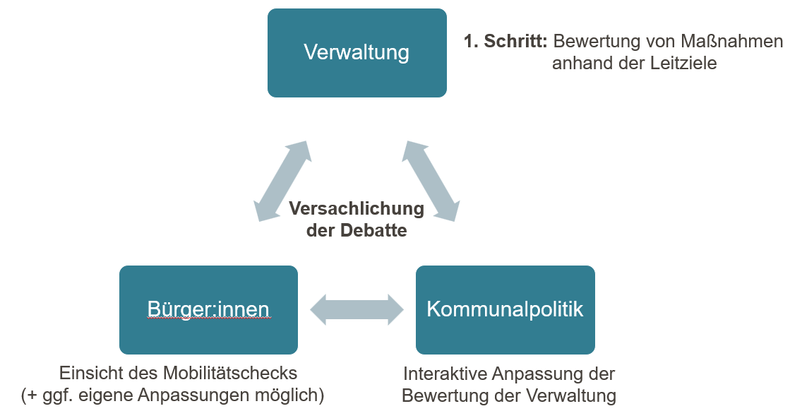

# Grundbausteine

Diese Seite erklärt die zentralen Konzepte und Objekte, mit denen im Mobilitätscheck für Magistratsvorlagen gearbeitet wird.

## Magistratsvorlage

Eine **Magistratsvorlage** ist das zentrale Arbeitsobjekt der Plattform. Sie entspricht einem kommunalen Vorhaben oder einer Entscheidungsvorlage, die in einem politischen Gremium (z. B. Stadtrat, Magistrat) beraten wird. Zu jeder Magistratsvorlage können ein oder mehrere Mobilitäts- und/oder Klimachecks erstellt werden.

## Mobilitätscheck

Der **Mobilitätscheck** dient als sachliche Diskussionsgrundlage eines Vorhabens. So können (Teil-)Vorhaben mit verkehrlichen Leitzielen der Kommune gegenübergestellt werden. Bei Bedarf können ein allumfassender Mobilitätscheck oder mehrere Mobilitätschecks für Teilvorhaben einer Magistratsvorlage erstellt werden. Der Mobilitätscheck baut auf einem zweistufigen Zielsystem auf. Dabei wird betrachtet, ob die Ober- und dazugehörigen Unterziele von dem Vorhaben tangiert werden. Wenn ja, dann werden bei den Unterzielen weiterführende Angaben zu Wirkungsstärke und -Richtung, räumlichen Auswirkung, eine textliche Erläuterung sowie Indikatoren angegeben. Das Ergebnis kann als PDF exportiert und einer Magistratsvorlage beigelegt werden.

Initial wird der Mobilitätscheck von Verwaltungsmitarbeitenden ausgefüllt, veröffentlicht und als PDF der Magistratsvorlage beigefügt. Im nächsten Schritt können Kommunalpolitiker:innen den Mobilitätscheck in der Webanwendung einsehen, duplizieren und bearbeiten. Sie können ebenfalls die Mobilitätschecks veröffentlichen. Alle veröffentlichten Mobilitätschecks sind für die Allgemeinheit ohne Anmeldung aufruf- und einsehbar.

### Leitziele

**Leitziele** sind politisch legitimierte Ziele einer Kommune im Bereich Mobilität. Sie bilden die inhaltliche Grundlage des Mobilitätschecks: Jedes Vorhaben wird daraufhin bewertet, wie es sich auf die einzelnen Leitziele auswirkt. Leitziele können öffentlich gemacht werden, sodass neue Kommunen sich an bereits vorhandene Leitzielsysteme orientieren können. Die Leitziele müssen für den Mobilitätscheck zweistufig in Ober- und Unterziele differenziert werden.

**Oberziele** sind übergeordnete Zielsetzungen. Beim Mobilitätscheck wird ledlglich betrachtet, ob das Oberziel inhaltlich tangiert wird.

**Unterziele** konkretisieren das zugehörige Oberziel und leiten sich aus diesem ab. Zunächst wird geschaut, ob das jeweilige Unterziel inhaltlich tangiert wird. Wenn ja, dann müssen weitere Angaben gemacht werden:

1. Wirkungsrichtung- und Stärke gibt an, ob sich das Vorhaben positiv oder negativ sowie mit welcher Stärke auf das Unterziel auswirkt.
2. Die räumliche Auswirkung gibt an, ob das Vorhaben sich lokal, quartiers- oder stadtweit auf das Unterziel auswirkt.
3. Zudem kann eine schriftliche Erläuterung hinterlegt werden.
4. Indikatoren dienen als Beleg für die schriftliche Erläuterung. Hier kann auf Regelwerke, Studien oder messbare Kennwerte hingewiesen werden.

## Textbausteine

**Textbausteine** sind vordefinierte Texte, die beim Ausfüllen eines Mobilitätschecks als Vorlage verwendet werden können. Sie helfen dabei, häufig wiederkehrende Formulierungen einheitlich und effizient einzusetzen. Textbausteine stehen ausschließlich Verwaltungsmitarbeitenden zur Verfügung und können interkommunal geteilt werden, um Synergieeffekte zu nutzen.

### Indikatoren

**Indikatoren** sind Regelwerke, Studien oder messbare Kennwerte, auf die sich die Erläuterung zur Auswirkung des Vorhabens auf ein Unterziel bezieht. Sie konkretisieren die Leitziele und machen die Bewertung im Mobilitätscheck nachvollziehbar und vergleichbar. Indikatoren können von Verwaltungsmitarbeitenden gepflegt und können interkommunal geteilt werden.

### Tags

**Tags** sind frei wählbare Schlagwörter zur Kategorisierung von Magistratsvorlagen, Indikatoren und anderen Objekten. Sie erleichtern das Filtern und Suchen innerhalb der Plattform. Tags werden von Verwaltungsmitarbeitenden gepflegt und können interkommunal geteilt werden.

## Klimacheck

Der **Klimacheck** bewertet die Klimaauswirkungen eines Vorhabens. Sie ist ausschließlich für Verwaltungsmitarbeitende zugänglich und nicht für Politik oder die Öffentlichkeit sichtbar. Wie der Mobilitätscheck wird sie zu einer Magistratsvorlage erstellt und dient der internen Bewertung.

Der Klimacheck basiert auf der Arbeit des Klimaschutzmanagements der Stadt Oberursel (Taunus).

## Gruppen

**Gruppen** sind Benutzergruppen innerhalb einer Kommune. Sie ermöglichen es, Verwaltungsmitarbeitende und Kommunalpolitiker:innen zu organisieren und Zugriffsrechte strukturiert zu vergeben. Auf der Verwaltungsebene können User in Abteilungen oder Dezernate gruppiert werden. Auf der Politikebene können User in Fraktionen oder Parteien gegliedert werden. Gruppen werden von kommunalen Administratoren verwaltet. User können ihre Gruppe aus eigenständig einstellen.

## Gebiete

**Gebiete** sind Stadtgebiete und Ortsteile einer Gemeinde. Sie werden im Mobilitätscheck verwendet, um ein Vorhaben räumlich einzuordnen. Kommunale Administratoren pflegen die Liste der Gebiete im Einstellungsbereich.
